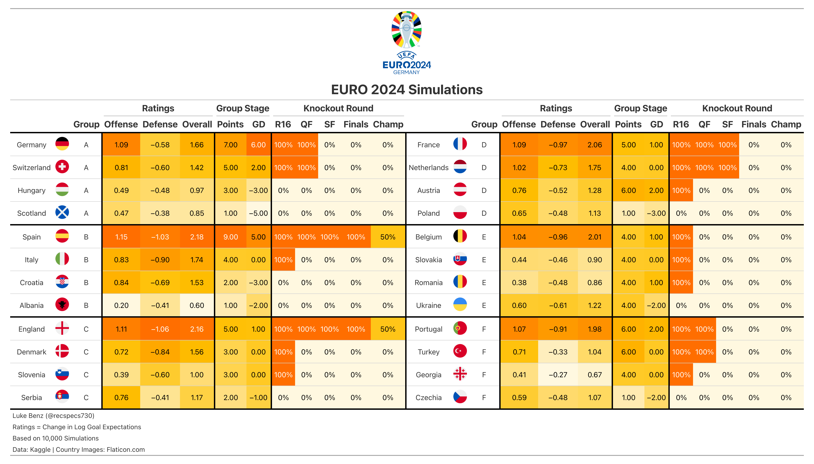
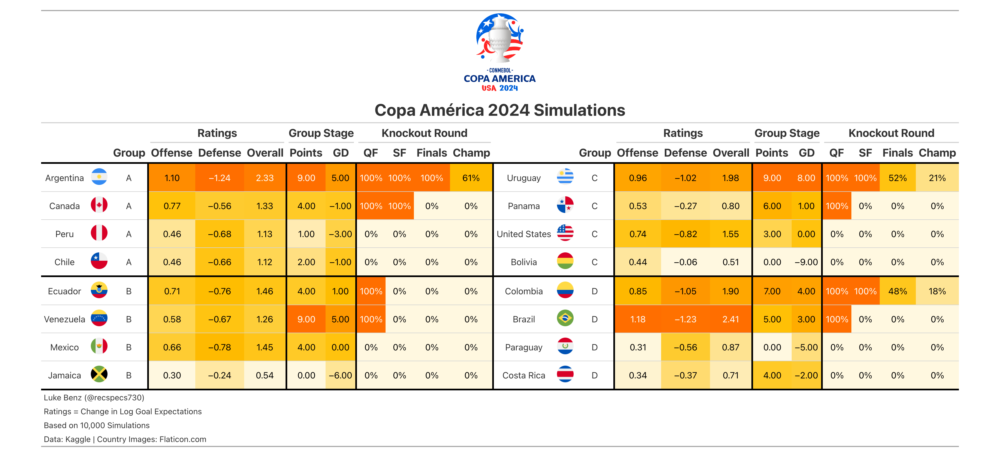

# International Soccer 2024 
---
Modeling and simulations and  for 2024 Euro Cup and Copa America. A write up of this project can be found [on my website](https://lukebenz.com/post/intl_soccer_2024/).


#### Model Script

* __fit_model.R:__ Estimates Bayesian bivariate Poisson model. For more details, see Equation (2) of [Benz and Lopez, 2021](https://arxiv.org/abs/2012.14949), or the breakdown [on my website](https://lukebenz.com/post/intl_soccer_2024/).

For working with the model coefficients, check out the file __predictions/ratings.csv__, with constants 

```
home_field = 0.3300421
neutral_field = 0.1849969
mu = -0.06282729
```

#### Simulations

* __euro_sim.R:__ Run 10,000 simulations of the tournament
* __helpers.R:__ Helper functions for sims.
* __game_preds.R__ Save out predictions for individual games.
* __graphics.R__: Script for plotting graphics related to tournament advancement history
* __make_table.R__: Script for making gt tables.


#### Data
Data (__internation_soccer_score.csv__) courtesy [Kaggle](https://www.kaggle.com/martj42/international-football-results-from-1872-to-2017).

Flag figures courtesy of [Flaticon](https://www.flaticon.com/).


#### Pre-Tournament Predictions


